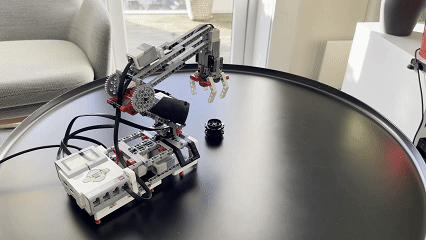
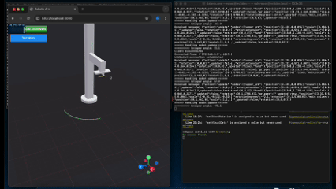
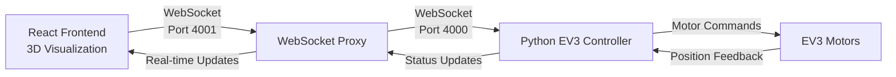

# Robot Arm Control System



# Overview

### The Beginning: Inspiration from Industry

After visiting the 1x.tech office and seeing your innovative work in real-time systems and robotics. This inspired me to create a project that would not only help me understand WebSocket and TCP/IP communications technologies better but also mirror the kind of real-time control systems used in professional settings.

The result is this robotic arm project, built using the **LEGO EV3 Mindstorms** (model H25) platform. By implementing real-time communication through **WebSockets**, I've created a system that demonstrates practical applications of modern web technologies in robotics control.

The project combines **React**, **TypeScript** and **Python** to create a seamless WebSocket communication layer, enabling responsive, real-time control of the robotic arm. This approach "parallels" the industrial solutions I observed, while providing hands-on experience with crucial networking and control system concepts.

[GIF needed: Show the complete robot arm setup responding to real-time controls through the web interface]

## Table of Contents
- [Overview](#overview)
- [Features](#features)
- [Technologies](#technologies)
  - [Hardware](#hardware)
  - [Software](#software)
  - [Project Structure](#project-structure)
  - [Architecture](#architecture)
  - [Data Flow Between Interface and Robot](#data-flow-between-interface-and-robot)
  - [WebSocket Message Format](#websocket-message-format)
    - [Update Message](#update-message)
    - [Response Format](#response-format)
    - [Length Encoding](#length-encoding)
  - [Supported Data Types](#supported-data-types)
    - [Robot Node Structure](#robot-node-structure)
    - [Motor Commands](#motor-commands)
    - [Message Validation and Processing](#message-validation-and-processing)
    - [Transform Calculations and Data Mapping](#transform-calculations-and-data-mapping)
    - [State Updates and Error Handling](#state-updates-and-error-handling)
    - [Node Updates and Movement Processing](#node-updates-and-movement-processing)
    - [Motor Response Processing](#motor-response-processing)
  - [Detailed Data Types and Movement Control](#detailed-data-types-and-movement-control)
- [Implementation Details](#implementation-details)
  - [Core EV3 System Functions](#core-ev3-system-functions)
    - [Motor Detection](#motor-detection)
    - [Motor Type Resolution](#motor-type-resolution)
    - [WebSocket Frame Creation](#websocket-frame-creation)
    - [Robot State Updates](#robot-state-updates)
    - [WebSocket Server Connection](#websocket-server-connection)
    - [Robot State Management](#robot-state-management)
  - [WebSocket Proxy Server](#websocket-proxy-server)
    - [Core Implementation](#core-implementation)
    - [Connection Management](#connection-management)
    - [Data Relay](#data-relay)
    - [Error Handling](#error-handling)
  - [Frontend-Backend Connection](#frontend-backend-connection)
    - [WebSocket Hook Implementation](#websocket-hook-implementation)
    - [Connection Initialization](#connection-initialization)
    - [Robot Data Updates](#robot-data-updates)
    - [Error Management](#error-management)
    - [Motor Testing Interface](#motor-testing-interface)
  - [Three.js + React Integration](#threejs--react-integration)
    - [Main Robot Arm Component](#main-robot-arm-component)
    - [Gizmo Control System](#gizmo-control-system)
    - [Transform Calculations](#transform-calculations)
    - [Movement Constraints](#movement-constraints)
    - [Mesh Handling](#mesh-handling)
    - [Scene Setup](#scene-setup)
- [Challenges & Solutions](#challenges--solutions)
  - [WebSocket Communication Challenges](#websocket-communication-challenges)
    - [Frame Decoding Issues](#frame-decoding-issues)
    - [Connection Stability Problems](#connection-stability-problems)
    - [Data Synchronization](#data-synchronization)
    - [WebSocket Proxy Implementation](#websocket-proxy-implementation)
    - [Binary Data Handling](#binary-data-handling)
  - [Motor Control Challenges](#motor-control-challenges)
    - [Gear Ratio Calculations](#gear-ratio-calculations)
  - [3D Visualization Challenges](#3d-visualization-challenges)
    - [GLTF Model Loading](#gltf-model-loading)
    - [Real-time Updates Synchronization](#real-time-updates-synchronization)
  - [Error Handling Challenges](#error-handling-challenges)
    - [Connection Loss Recovery](#connection-loss-recovery)
    - [Motor Failure Handling](#motor-failure-handling)
  - [State Management Challenges](#state-management-challenges)
    - [Multiple Component State Synchronization](#multiple-component-state-synchronization)
  - [Performance Issues](#performance-issues)
    - [WebSocket Message Processing](#websocket-message-processing)
    - [Movement Calculations Optimization](#movement-calculations-optimization)
- [Conclusion](#conclusion)
  - [Project Overview](#project-overview)
  - [Technical Achievements](#technical-achievements)
  - [Technical Challenges Overcome](#technical-challenges-overcome)
  - [Future Improvements](#future-improvements)
  - [Final Thoughts](#final-thoughts)

# Features
- Real-time **WebSocket** communication
- 3D visualization with **Three.js**
- Custom motor control system
- Error recovery and connection management
- Position tracking and feedback



# Technologies
### Hardware
- LEGO EV3 Mindstorms (model H25)
- Motors: 2x Large Motor, 1x Medium Motor

### Software
- Frontend: React, TypeScript, Three.js
- Backend: Python, WebSocket Server
- 3D: Blender (.glb models)
- EV3: [ev3dev](https://www.ev3dev.org/)

# Project Structure
```
robot-arm/
│
├── front/
│   ├── public/
│   │   ├── robot.glb
│   │   └── robot_v2.glb
│   │
│   ├── src/
│   │   ├── components/
│   │   │   ├── gizmo/
│   │   │   ├── mesh/
│   │   │   ├── model/
│   │   │   ├── stage/
│   │   │   ├── status/
│   │   │   └── error/
│   │   │
│   │   ├── hooks/
│   │   │   └── useWebSocket.ts
│   │   │
│   │   ├── types/
│   │   │   └── index.ts
│   │   │
│   │   ├── utils/
│   │   │   ├── angles.ts
│   │   │   └── transforms.ts
│   │   │
│   │   └── App.tsx
│   │
│   ├── package.json
│   └── tsconfig.json
│
├── ev3dev/
│   ├── ev3.py           # Main robot control script
│   ├── motor_test.py    # Motor testing utilities
│   ├── websocket_proxy.py
│   └── websocket_test.py
│
└── model/               # 3D model files and documentation
    ├── robot.glb
    └── README.md
```

## Architecture


## Data Flow Between Interface and Robot

### Frontend to Backend Flow
```typescript
const updateRobotData = useCallback((newData: Partial<Robot.RobotNodes>) => {
    if (!ws || ws.readyState !== WebSocket.OPEN) {
      initWebSocket();
      return;
    }

    setRobotData(prevData => {
      if (prevData) {
        const updatedData = {...prevData, ...newData};
        ws.send(JSON.stringify({
          action: 'update',
          ...updatedData
        }));
        return updatedData;
      }
      return prevData;
    });
}, [ws, initWebSocket]);
```
This is the primary function responsible for sending data from the frontend to the robot. When a user interacts with the 3D model or control interface, this function captures the changes and formats them into a message for the robot. The function first checks if the WebSocket connection is active, and if not, it attempts to reinitialize the connection before sending any data.

### Backend to Motors
```python
def handle_robot_update(data):
    try:
        state = json.loads(data)
        if 'action' in state:
            del state['action']
            
        nodes = state.get('nodes', {})
        response = {"status": "success", "message": [], "state": state}
        
        if updated_node == 'gripper' and motors['A']:
            angle = nodes['gripper'].get('rotationDegrees', 0)
            try:
                motors['A'].on_for_degrees(speed=20, degrees=angle)
                response["message"].append("Gripper motor moved")
            except Exception as e:
                response["message"].append("Gripper motor error: " + str(e))
```
The backend receives WebSocket messages and translates them into motor commands. This function handles the actual motor control by interpreting the received state data and converting it into physical motor movements. Each motor command is executed with proper error handling and status reporting.

### Feedback Flow
```typescript
websocket.onmessage = (event) => {
    try {
        const response = JSON.parse(event.data);
        if (response.state?.nodes) {
            setRobotData(response.state);
        }
        
        if (response.message) {
            setMotorStatus(prev => {
                const newStatus = {...prev};
                if (response.message.includes('Base motor')) {
                    newStatus.base = response.message.includes('not available') ? 
                        'disconnected' : 'connected';
                }
                return newStatus;
            });
        }
    } catch (e) {
        console.error('Parse error:', e);
    }
};
```
The feedback system ensures that the frontend stays synchronized with the physical robot state. It processes both state updates and motor status messages, updating the UI accordingly. The system handles multiple types of feedback including motor positions, connection status, and error conditions.

## WebSocket Message Format

### Update Message
```typescript
// Type definition for robot nodes
export interface RobotNodes {
    nodes: {
        [NodeName.mainColumn]: RobotNode,
        [NodeName.upperArm]: RobotNode,
        [NodeName.wristExtension]: RobotNode,
        [NodeName.hand]: RobotNode,
        [NodeName.gripper]: RobotNode
    }
}

// Example message being sent
const message = {
    action: 'update',
    nodes: {
        gripper: {
            position: [3.33, 5.545, 0.006],
            scale: [-0.01, -0.132, -0.325],
            rotation: [0, 1.5708, 0],
            rotationDegrees: 45,
            _updated: true
        }
    }
}
```
The update message format carries all necessary information about the robot's state. Each message contains specific node information including position, rotation, and scale values. The `_updated` flag helps optimize processing by indicating which parts of the robot have actually changed.

### Response Format
```python
def create_websocket_frame(data):
    try:
        if isinstance(data, str):
            data = data.encode('utf-8')

        length = len(data)
        frame = bytearray()
        frame.append(0x81)  # Text frame
        
        if length <= 125:
            frame.append(length)
        elif length <= 65535:
            frame.append(126)
            frame.append((length >> 8) & 0xFF)
            frame.append(length & 0xFF)
            
        frame.extend(data)
        return bytes(frame)
    except Exception as e:
        return None
```
The WebSocket frame creation follows the standard WebSocket protocol specification. This implementation handles different payload sizes and ensures proper frame formatting. The function supports both small and medium-sized messages, with appropriate length encoding.

```python
def create_websocket_frame(data):
    frame = bytearray()
    frame.append(0x81)  # Text frame
```

The `0x81` byte is composed of:
- `1000` (0x8) - FIN bit set to 1, indicating this is the final fragment
- `0001` (0x1) - Opcode for text frame

## Length Encoding
```python
if length <= 125:
    frame.append(length)
elif length <= 65535:
    frame.append(126)
    frame.append((length >> 8) & 0xFF)
    frame.append(length & 0xFF)
```

The WebSocket protocol defines specific length thresholds:
1. **0-125 bytes**: Length stored in a single byte
   - Most efficient for small messages
   - Common for simple commands and status updates

2. **126-65535 bytes**: 
   - Uses `126` as marker
   - Followed by 2 bytes (16 bits) for actual length
   - Supports messages up to 64KB

3. **> 65535 bytes**: 
   - Uses `127` as marker (not implemented in our code)
   - Followed by 8 bytes for length
   - Supports messages up to 2^64 bytes

Our implementation uses only first two formats because:
- Robot commands are typically small (<125 bytes)
- State updates rarely exceed 65KB
- Larger frames would increase latency
- EV3's limited memory better suits smaller frames

```python
frame.append((length >> 8) & 0xFF)  # High byte
frame.append(length & 0xFF)         # Low byte
```

For 16-bit length encoding:
1. `length >> 8`: Shifts right 8 bits to get high byte
2. `& 0xFF`: Masks to ensure single byte (0-255)
3. Two bytes allow length range: 0 to 65535

Example for length 1000:
```
1000 in binary:    0000 0011 1110 1000
High byte (>>8):   0000 0011 (3)
Low byte (& 0xFF): 1110 1000 (232)
```

## Supported Data Types

### Robot Node Structure
```typescript
export type RobotNode = {
    position: Vector3,
    scale: Vector3
    rotation?: Vector3
}

export type GizmoTransform = {
    position: [number, number, number];
    rotation: [number, number, number];
};

export type GizmoProperties = {
    scale?: number
    matrix?: Matrix4
    anchor?: [number, number, number]
    activeAxes?: [boolean, boolean, boolean]
    disableTranslation?: boolean
    disableRotation?: boolean
    translationLimits?: [[number, number] | undefined, [number, number] | undefined, [number, number] | undefined]
    rotationLimits?: [[number, number] | undefined, [number, number] | undefined, [number, number] | undefined]
    userData?: { [key: string]: any }
}
```
The type system is designed to handle all aspects of robot control and visualization. The RobotNode type defines the basic structure for each robot component, including position, scale, and optional rotation. The GizmoTransform type specifically handles transformation data during user interaction. GizmoProperties defines all possible configuration options for the control interface.

### Motor Commands
```python
DEFAULT_ROBOT_STATE = {
    "nodes": {
        "main_column": {
            "position": [0, 1.462, 0],
            "scale": [1, 1, 1],
            "rotation": [0, 0, 0]
        },
        "upper_arm": {
            "position": [2.335, 0, 0.094],
            "scale": [0.684, 1, 1],
            "rotation": [0, 0, 0]
        }
    }
}
```
The default robot state demonstrates the structured format used for motor control. Each node in the robot has specific position, scale, and rotation values that correspond to physical motor positions. This structure ensures consistent transformation between visual representation and physical movement.

### Message Validation and Processing

```python
def is_valid_json_frame(data):
   try:
       if data[0] == 0x81:  # WebSocket text frame
           mask_start = 2
           payload_length = data[1] & 0x7F
           
           if payload_length == 126:
               if len(data) < 4:
                   return False
               payload_length = (data[2] << 8) | data[3]
               mask_start = 4

           if len(data) < mask_start + 4 + payload_length:
               return False

           mask = data[mask_start:mask_start + 4]
           payload = bytearray()
           
           for i in range(mask_start + 4, mask_start + 4 + payload_length):
               payload.append(data[i] ^ mask[(i - (mask_start + 4)) % 4])

           decoded = payload.decode('utf-8')
           json.loads(decoded)  # Check if it's valid JSON
           return True
   except:
       return False
```
This validation function ensures that all incoming WebSocket frames are properly formatted and contain valid JSON data. It handles the WebSocket frame structure, including checking the frame type (0x81 for text frames), managing payload lengths, and properly unmasking the data. The function is crucial for maintaining data integrity in the communication pipeline.

### Transform Calculations and Data Mapping

```typescript
export const calculateRobotTransforms = {
  upperArm: (currentHeight: number, initialHeight: number) => {
    const heightChange = currentHeight - initialHeight;
    // Gear ratio is 6:1 and direction is reversed
    const gearRatioElbow = 6;
    // Height ratio is 30:1 and direction is reversed
    const heightRatioElbow = 30;
    const direction = -1;

    return heightChange * heightRatioElbow * direction * gearRatioElbow;
  },

  mainColumn: (currentPositions: number[], startRotation: number) => {
    const euler = new Euler().fromArray(currentPositions);
    const endDegrees = (euler.y * 180) / Math.PI;
    const totalRotation = endDegrees - (startRotation || 0);
    // Gear ratio is 4:1 and direction is reversed
    const gearRatioBase = 4;
    const direction = -1;

    return totalRotation * gearRatioBase * direction;
  }
};
```
The transform calculations handle the conversion between visual representation and physical motor movements. This system accounts for different gear ratios and movement directions for each motor type. The calculations ensure precise movement mapping between the 3D interface and physical robot.

### State Updates and Error Handling

```typescript
websocket.onmessage = (event) => {
  try {
    const response = JSON.parse(event.data);
    if (response.state?.nodes) {
      setRobotData(response.state);
    }
    
    if (response.message) {
      setMotorStatus(prev => {
        const newStatus = {...prev};
        if (response.message.includes('Base motor')) {
          newStatus.base = response.message.includes('not available') ? 
            'disconnected' : 'connected';
        }
        if (response.message.includes('Elbow motor')) {
          newStatus.elbow = response.message.includes('not available') ? 
            'disconnected' : 'connected';
        }
        return newStatus;
      });
    }
  } catch (e) {
    console.error('Parse error:', e);
  }
};
```
The message handling system processes both state updates and error messages. It maintains the current state of each motor and updates the UI accordingly. This system ensures that users always have accurate feedback about the robot's status and any potential issues.

### Node Updates and Movement Processing

```typescript
const handleDragEnd = (nodeName: Robot.NodeName) => {
    const current = currentPositions[nodeName] || 0;
    const initial = startPosition[nodeName] || 0;
    let rotationDegrees = 0;

    if (nodeName === node.upperArm) {
        rotationDegrees = calculateRobotTransforms.upperArm(current, initial);
    } else if (nodeName === node.gripper) {
        rotationDegrees = calculateRobotTransforms.gripper(current, initial);
    } else if (nodeName === node.mainColumn) {
        rotationDegrees = calculateRobotTransforms.mainColumn(currentPositions[nodeName], startRotation[nodeName]);
    }

    const ev3Data = createNodeUpdate(nodeName, data, rotationDegrees);
    onUpdate(ev3Data);
```
The node update system handles the completion of user interactions with the 3D interface. It calculates the final position or rotation values and creates appropriate update messages for the robot. This system ensures smooth transitions between user input and physical movement.

### Motor Response Processing

```python
def handle_motor_command(motor_id, command):
    try:
        state = json.loads(data)
        nodes = state.get('nodes', {})
        response = {"status": "success", "message": [], "state": state}
        
        if updated_node == 'gripper' and motors['A']:
            angle = nodes['gripper'].get('rotationDegrees', 0)
            try:
                motors['A'].on_for_degrees(speed=20, degrees=angle)
                response["message"].append("Gripper motor moved")
            except Exception as e:
                response["message"].append("Gripper motor error: " + str(e))

        return response
    except Exception as e:
        return {"status": "error", "message": str(e)}
```
The motor command handler processes incoming movement requests and manages motor execution. It includes error handling for motor failures and provides detailed feedback about the execution status. The system ensures safe and reliable motor control while maintaining communication with the frontend.

## Detailed Data Types and Movement Control

### Robot Node Types and Structure
```typescript
export interface RobotNodes {
    nodes: {
        [NodeName.mainColumn]: RobotNode,
        [NodeName.upperArm]: RobotNode,
        [NodeName.wristExtension]: RobotNode,
        [NodeName.hand]: RobotNode,
        [NodeName.gripper]: RobotNode
    }
}

export enum NodeName {
    mainColumn = 'main_column',
    upperArm = 'upper_arm',
    wristExtension = 'wrist_extension',
    hand = 'hand',
    gripper = 'gripper'
}
```
The robot's structure is defined through a clear type hierarchy. Each node represents a specific part of the robot arm, with defined properties for position, rotation, and scale. The enum ensures type safety when referencing different parts of the robot. This structured approach prevents errors in movement commands and state updates.

### Default Robot Configuration
```typescript
const DEFAULT_ROBOT_STATE = {
    "nodes": {
        "main_column": {
            "position": [0, 1.462, 0],
            "scale": [1, 1, 1],
            "rotation": [0, 0, 0]
        },
        "upper_arm": {
            "position": [2.335, 0, 0.094],
            "scale": [0.684, 1, 1],
            "rotation": [0, 0, 0]
        },
        "wrist_extension": {
            "position": [3.231, 6.551, 0.007],
            "scale": [0.264, 0.264, 0.264],
            "rotation": [0, 0, 0]
        },
        "hand": {
            "position": [3.368, 5.728, -0.119],
            "scale": [1, 0.068, 0.327],
            "rotation": [0, 1.5708, 0]
        },
        "gripper": {
            "position": [3.33, 5.545, 0.006],
            "scale": [-0.01, -0.132, -0.325],
            "rotation": [0, 1.5708, 0]
        }
    }
}
```
The default state provides initial positions for all robot components. These values are calibrated to match the physical robot's home position. Each node's position, scale, and rotation are precisely defined to ensure accurate visual representation and movement control.

### Message Flow Formats
```typescript
// Outgoing message format
const updateMessage = {
    action: 'update',
    nodes: {
        [nodeName]: {
            position: data.position,
            rotation: data.rotation,
            rotationDegrees: calculatedDegrees,
            _updated: true
        }
    }
};

// Incoming message processing
websocket.onmessage = (event) => {
    try {
        const response = JSON.parse(event.data);
        // State update message
        if (response.state?.nodes) {
            setRobotData(response.state);
        }
        // Status update message
        if (response.status === 'success') {
            const { message, state } = response;
        }
        // Error message
        if (response.status === 'error') {
            setError(response.message);
        }
    } catch (e) {
        console.error('Parse error:', e);
    }
};
```
The message system uses a consistent format for all communications. Updates include specific node data with position and rotation information. Response messages follow a standard structure with status indicators and relevant data. This standardization ensures reliable communication between frontend and backend.

### Movement Control Types
```typescript
export type GizmoTransform = {
    position: [number, number, number];
    rotation: [number, number, number];
};

export type GizmoProperties = {
    scale?: number
    matrix?: Matrix4
    anchor?: [number, number, number]
    activeAxes?: [boolean, boolean, boolean]
    disableTranslation?: boolean
    disableRotation?: boolean
    translationLimits?: [[number, number] | undefined, [number, number] | undefined, [number, number] | undefined]
    rotationLimits?: [[number, number] | undefined, [number, number] | undefined, [number, number] | undefined]
}
```
The movement control system uses specialized types to manage transformations and constraints. GizmoTransform handles the actual position and rotation updates. GizmoProperties defines all possible movement constraints and limitations. This type system ensures safe and controlled robot movement.

### Python Motor Control Types
```python
def get_motor(port):
    try:
        motor_path = "/sys/class/tacho-motor/"
        for device in os.listdir(motor_path):
            with open(os.path.join(motor_path, device, 'address'), 'r') as f:
                if port in f.read():
                    with open(os.path.join(motor_path, device, 'driver_name'), 'r') as f:
                        if 'lego-ev3-m-motor' in f.read():
                            return MediumMotor(port)
                        else:
                            return LargeMotor(port)
    except Exception as e:
        return None
```
The motor control system differentiates between medium and large motors. Each motor type has specific characteristics and control parameters. The system automatically detects and configures the appropriate motor type based on the hardware connection.

### State Management Types
```typescript
const [motorStatus, setMotorStatus] = useState<{[key: string]: string}>({
    base: 'unknown',
    elbow: 'unknown',
    height: 'unknown'
});

const [connectionStatus, setConnectionStatus] = useState('disconnected');
const [error, setError] = useState<string>('');
```
The state management system uses specific types to track various aspects of the robot's operation. Motor status tracking provides real-time feedback about each motor's condition. Connection and error states ensure proper system monitoring and error handling.

# Implementation Details

## Core EV3 System Functions

## 1. Motor Detection
```python
def check_motors():
    motors = {}
    try:
        motor_path = "/sys/class/tacho-motor/"
        if os.path.exists(motor_path):
            devices = os.listdir(motor_path)
            for device in devices:
                with open(os.path.join(motor_path, device, 'address'), 'r') as f:
                    port = f.read().strip()
                with open(os.path.join(motor_path, device, 'driver_name'), 'r') as f:
                    driver = f.read().strip()
    except Exception as e:
        print("Error scanning devices: " + str(e))
```

Key design choices:
- **System Level Detection**: Uses direct filesystem access to detect motors 
- **Dynamic Discovery**: Automatically finds all connected motors without hardcoding
- **Diagnostic Information**: Provides detailed information about motor type and port
- **Error Resilience**: Continues operation even if some motors aren't found

## 2. Motor Type Resolution
```python
def get_motor(port):
    try:
        motor_path = "/sys/class/tacho-motor/"
        for device in os.listdir(motor_path):
            with open(os.path.join(motor_path, device, 'address'), 'r') as f:
                if port in f.read():
                    with open(os.path.join(motor_path, device, 'driver_name'), 'r') as f:
                        if 'lego-ev3-m-motor' in f.read():
                            return MediumMotor(port)
                        else:
                            return LargeMotor(port)
    except Exception as e:
        return None
```

Implementation benefits:
- **Automatic Type Detection**: Determines correct motor type based on hardware response
- **Safe Initialization**: Returns None instead of crashing on failure
- **Flexible Port Handling**: Works with any valid EV3 port
- **Driver-Based Detection**: Uses driver information for accurate motor type identification

## 3. WebSocket Frame Creation
```python
def create_websocket_frame(data):
    try:
        if isinstance(data, str):
            data = data.encode('utf-8')

        length = len(data)
        frame = bytearray()
        frame.append(0x81)  # Text frame
        
        if length <= 125:
            frame.append(length)
        elif length <= 65535:
            frame.append(126)
            frame.append((length >> 8) & 0xFF)
            frame.append(length & 0xFF)

        frame.extend(data)
        return bytes(frame)
    except Exception as e:
        return None
```

Key features:
- **Protocol Compliance**: Follows WebSocket frame format specification exactly
- **Size Handling**: Supports different payload sizes with appropriate length encoding
- **Text Frame Focus**: Optimized for text data which is our primary use case
- **Error Safety**: Returns None on failure instead of raising exceptions

## 4. Robot State Updates
```python
def handle_robot_update(data):
    try:
        state = json.loads(data)
        if 'action' in state:
            del state['action']
            
        nodes = state.get('nodes', {})
        response = {"status": "success", "message": [], "state": state}
        
        if updated_node == 'gripper' and motors['A']:
            angle = nodes['gripper'].get('rotationDegrees', 0)
            motors['A'].on_for_degrees(speed=20, degrees=angle)
            response["message"].append("Gripper motor moved")
            
        return response
    except Exception as e:
        return {"status": "error", "message": str(e)}
```

Design considerations:
- **State Management**: Clear separation between state and action handling
- **Response Format**: Consistent response structure with status and messages
- **Granular Updates**: Only processes changed nodes
- **Error Reporting**: Detailed error messages for debugging

## 5. WebSocket Server Connection
```python
server = socket.socket(socket.AF_INET, socket.SOCK_STREAM)
server.setsockopt(socket.SOL_SOCKET, socket.SO_REUSEADDR, 1)
server.bind(('0.0.0.0', 4000))
server.listen(1)

while True:
    try:
        client, addr = server.accept()
        data = client.recv(1024)
        text_data = data.decode('utf-8', errors='ignore')
        
        if "Upgrade: websocket" in text_data:
            key = ""
            for line in text_data.split('\n'):
                if "Sec-WebSocket-Key" in line:
                    key = line.split(': ')[1].strip()
```

Implementation highlights:
- **Socket Reuse**: Enables quick server restart with SO_REUSEADDR
- **Universal Binding**: Listens on all interfaces (0.0.0.0)
- **WebSocket Handshake**: Proper protocol upgrade handling
- **Connection Security**: WebSocket key verification
- **Error Handling**: Graceful handling of connection issues

## 6. Robot State Management
```python
def handle_robot_update(data):
    state = json.loads(data)
    nodes = state.get('nodes', {})
    
    updated_node = next(
        (name for name, data in nodes.items() 
         if 'rotation' in data and data.get('_updated', False)),
        None
    )

    if updated_node == 'gripper' and motors['A']:
        angle = nodes['gripper'].get('rotationDegrees', 0)
        motors['A'].on_for_degrees(speed=20, degrees=angle)
```

This state management system was designed to:
- **Selective Updates**: Only processes nodes that have actually changed (marked with '_updated')
- **Safe Access**: Uses dictionary .get() method to safely handle missing data
- **Motor Mapping**: Direct mapping between node names and physical motors
- **Atomic Updates**: Each motor movement is handled independently


# WebSocket Proxy Server

The proxy server acts as a bridge between the browser client (port 4001) and EV3 robot (port 4000). This separation provides better error handling and connection management.

## Core Implementation
```python
BROWSER_PORT = 4001
EV3_HOST = '192.168.2.3' 
EV3_PORT = 4000

def handle_websocket_connection(browser_socket, ev3_socket):
    browser_socket.setblocking(0)
    ev3_socket.setblocking(0)
    
    inputs = [browser_socket, ev3_socket]
    
    while True:
        try:
            readable, _, exceptional = select.select(inputs, [], inputs, 1.0)
```

Key design choices:
- **Non-blocking Sockets**: Uses `setblocking(0)` for asynchronous operation
- **Select Implementation**: Efficient handling of multiple socket connections
- **Timeout Management**: 1-second timeout for responsive error handling
- **Port Separation**: Different ports for browser and EV3 connections

## Connection Management
```python
def main():
    server = socket.socket(socket.AF_INET, socket.SOCK_STREAM)
    server.setsockopt(socket.SOL_SOCKET, socket.SO_REUSEADDR, 1)
    server.bind(('0.0.0.0', BROWSER_PORT))
    server.listen(1)

    while True:
        try:
            browser_socket, addr = server.accept()
            ev3_socket = socket.socket(socket.AF_INET, socket.SOCK_STREAM)
            ev3_socket.connect((EV3_HOST, EV3_PORT))
```

Implementation benefits:
- **Connection Persistence**: Automatic reconnection on failure
- **Socket Reuse**: Fast server restart capability
- **Universal Access**: Listens on all interfaces (0.0.0.0)
- **Single Client**: Dedicated 1:1 connection between browser and robot

## Data Relay
```python
for sock in readable:
    if sock is browser_socket:
        data = sock.recv(1024)
        if not data:
            print("Browser disconnected")
            return
            
        if data[0] == 0x81:  # WebSocket text frame
            print("Browser -> EV3 (WS frame)")
            ev3_socket.send(data)
        
    elif sock is ev3_socket:
        data = sock.recv(1024)
        if not data:
            print("EV3 disconnected")
            return
            
        print("EV3 -> Browser")
        browser_socket.send(data)
```

Design considerations:
- **Frame Validation**: Checks for valid WebSocket frames (0x81)
- **Bidirectional Communication**: Handles both browser->EV3 and EV3->browser flows
- **Disconnect Detection**: Immediate notification of connection loss
- **Data Integrity**: Direct relay without modification

## Error Handling
```python
try:
    browser_socket, addr = server.accept()
    print("Browser connected from " + str(addr))
    
    ev3_socket = socket.socket(socket.AF_INET, socket.SOCK_STREAM)
    print("Connecting to EV3...")
    ev3_socket.connect((EV3_HOST, EV3_PORT))
    print("Connected to EV3")
except Exception as e:
    print("Error: " + str(e))
finally:
    try:
        browser_socket.close()
        ev3_socket.close()
    except:
        pass
```

Key features:
- **Graceful Shutdown**: Proper socket cleanup in all scenarios
- **Connection Logging**: Detailed status messages for debugging
- **Error Recovery**: Automatic restart on connection failure
- **Resource Management**: Ensures sockets are always properly closed

[GIF needed: Demonstration of proxy server handling connection loss and recovery]

# Frontend-Backend Connection

## WebSocket Hook Implementation
```typescript
export const useWebSocket = () => {
  const [robotData, setRobotData] = useState<Robot.RobotNodes>();
  const [ws, setWs] = useState<WebSocket | null>(null);
  const [connectionStatus, setConnectionStatus] = useState('disconnected');
  const [error, setError] = useState<string>('');
  const [motorStatus, setMotorStatus] = useState<{[key: string]: string}>({
    base: 'unknown',
    elbow: 'unknown',
    height: 'unknown'
  });
```

Key design choices:
- **State Management**: Separate states for different aspects of the connection
- **Type Safety**: TypeScript interfaces for robot data structure
- **Motor Status Tracking**: Real-time status for each motor
- **Error Handling**: Dedicated error state for user feedback

## Connection Initialization
```typescript
const initWebSocket = useCallback(() => {
    const websocket = new WebSocket(SOCKET_SERVER_URL);
    
    websocket.onopen = () => {
      setConnectionStatus('connected');
      setWs(websocket);
    };

    websocket.onmessage = (event) => {
      try {
        const response = JSON.parse(event.data);
        if (response.state?.nodes) {
          setRobotData(response.state);
        }
        
        if (response.message) {
          setMotorStatus(prev => {
            const newStatus = {...prev};
            if (response.message.includes('Base motor')) {
              newStatus.base = response.message.includes('not available') ? 
                'disconnected' : 'connected';
            }
            // Similar checks for other motors
            return newStatus;
          });
        }
      } catch (e) {
        console.error('Parse error:', e);
      }
    };
```

Implementation benefits:
- **Auto-Reconnection**: Automatic connection retry on failure
- **State Updates**: Real-time UI updates based on robot state
- **Message Parsing**: Structured handling of different message types
- **Status Tracking**: Detailed motor status updates

## Robot Data Updates
```typescript
const updateRobotData = useCallback((newData: Partial<Robot.RobotNodes>) => {
    if (!ws || ws.readyState !== WebSocket.OPEN) {
      initWebSocket();
      return;
    }

    setRobotData(prevData => {
      if (prevData) {
        const updatedData = {...prevData, ...newData};
        ws.send(JSON.stringify({
          action: 'update',
          ...updatedData
        }));
        return updatedData;
      }
      return prevData;
    });
}, [ws, initWebSocket]);
```

Design considerations:
- **Connection Check**: Verifies WebSocket state before sending
- **Data Merging**: Efficient update of partial robot state
- **Action Identification**: Clear action type for backend processing
- **State Consistency**: Atomic updates to prevent race conditions

## Error Management
```typescript
websocket.onerror = () => {
  setConnectionStatus('error');
};

websocket.onclose = () => {
  setConnectionStatus('disconnected');
  setWs(null);
  setTimeout(initWebSocket, 1000);
};
```

Key features:
- **Error States**: Clear distinction between different connection states
- **Reconnection Logic**: Automatic retry with delay
- **Resource Cleanup**: Proper WebSocket closure handling
- **User Feedback**: Real-time connection status updates

## Motor Testing Interface
```typescript
const testMotor = useCallback(() => {
    if (ws?.readyState === WebSocket.OPEN) {
      ws.send(JSON.stringify({ action: 'test_motor' }));
    }
}, [ws]);
```

Implementation highlights:
- **Simple Testing**: Easy motor test functionality
- **Connection Check**: Safety check before sending commands
- **Structured Messages**: Consistent message format
- **Action-based Communication**: Clear action identifiers

[GIF needed: Show real-time status updates in UI during connection/disconnection events]

# Three.js + React Integration and 3D Manipulations

## Main Robot Arm Component
```typescript
export const RobotArm = ({data, onUpdate}: RobotProps) => {
    const {nodes} = useGLTF('/robot.glb') as unknown as Robot.DreiGLTF;
    const node = Robot.NodeName;
    const [startRotation, setStartRotation] = useState<{[key: string]: number}>({});
    const [startPosition, setStartPosition] = useState<{[key: string]: number}>({});
    const [currentPositions, setCurrentPositions] = useState<{[key: string]: number}>({});
    const [visualData, setVisualData] = useState<Robot.RobotNodes>(data);
```

Key design elements:
- **GLTF Model Loading**: Using useGLTF for efficient 3D model management
- **Position Tracking**: Separate states for start and current positions
- **Type Safety**: Strong typing for all robot nodes and positions
- **Visual State**: Dedicated state for visual representation

## Gizmo Control System
```typescript
const handleGizmoUpdate = (nodeName: Robot.NodeName, transform: Robot.GizmoTransform) => {
    if (nodeName === node.upperArm) {
        setCurrentPositions(prev => ({...prev, [nodeName]: transform.position[1]}));
    } else if (nodeName === node.gripper) {
        setCurrentPositions(prev => ({...prev, [nodeName]: transform.position[2]}));
    } else {
        setCurrentPositions(prev => ({...prev, [nodeName]: transform.rotation}));
    }
};

const handleDragStart = (nodeName: Robot.NodeName, transform: Robot.GizmoTransform) => {
    if (nodeName === node.upperArm) {
        setStartPosition(prev => ({...prev, [nodeName]: transform.position[1]}));
    } else if (nodeName === node.gripper) {
        setStartPosition(prev => ({...prev, [nodeName]: transform.position[2]}));
    }
};
```

Implementation features:
- **Node-Specific Handling**: Different logic for each robot part
- **Position/Rotation Management**: Separate handling of position and rotation transforms
- **State Updates**: Atomic updates for each drag operation
- **Transform Mapping**: Direct mapping between 3D transforms and motor positions


## Transform Calculations
```typescript
export const calculateRobotTransforms = {
  upperArm: (currentHeight: number, initialHeight: number) => {
    const heightChange = currentHeight - initialHeight;
    // Gear ratio is 6:1 and direction is reversed
    const gearRatioElbow = 6;
    // Height ratio is 30:1 and direction is reversed
    const heightRatioElbow = 30;
    const direction = -1;

    return heightChange * heightRatioElbow * direction * gearRatioElbow;
  },

  mainColumn: (currentPositions: number[], startRotation: number) => {
    const euler = new Euler().fromArray(currentPositions);
    const endDegrees = (euler.y * 180) / Math.PI;
    const totalRotation = endDegrees - (startRotation || 0);
    // Gear ratio is 4:1 and direction is reversed
    const gearRatioBase = 4;
    const direction = -1;

    return totalRotation * gearRatioBase * direction;
  }
};
```

Key calculations:
- **Gear Ratios**: Accurate conversion between visual and physical movement
- **Direction Handling**: Proper handling of motor direction
- **Angle Conversion**: Conversion between radians and degrees
- **Initial Position Offset**: Compensation for starting positions

## Movement Constraints
```typescript
<Gizmo scale={5}
       disableTranslation
       activeAxes={[true, false, true]}
       userData={[node.mainColumn]}
       onDragStart={() => handleDragStart(node.mainColumn, {
           position: visualData.nodes[node.mainColumn].position, 
           rotation: visualData.nodes[node.mainColumn].rotation
       })}
       onDragEnd={() => handleDragEnd(node.mainColumn)}
       onUpdate={(transform) => handleGizmoUpdate(node.mainColumn, transform)}>
    <Mesh node={nodes[node.mainColumn]} data={visualData.nodes[node.mainColumn]}/>
```

Design considerations:
- **Axis Constraints**: Limited movement axes based on physical capabilities
- **Scale Management**: Appropriate scaling for visual feedback
- **Event Handling**: Complete drag cycle management
- **Visual Updates**: Real-time mesh updates during manipulation


## Mesh Handling
```typescript
const Mesh = ({node, data}: Robot.MeshProperties) => {
    const rotation = data.rotation.length > 0 ? 
        new Euler().fromArray(data.rotation) : 
        new Euler(0, 0, 0);

    return (
        <mesh geometry={node.geometry}
              material={node.material}
              position={data.position}
              rotation={rotation}
              scale={data.scale}
        />
    )
}
```

Implementation details:
- **Euler Angles**: Proper rotation handling using Euler angles
- **Default Values**: Fallback values for undefined rotations
- **Property Mapping**: Direct mapping between data and Three.js properties
- **Material Preservation**: Maintains original model materials

## Scene Setup
```typescript
return (
    <>
        <Canvas>
            <PerspectiveCamera makeDefault fov={40} position={[10, 8, 25]}/>
            <RobotArm data={robotData} onUpdate={updateRobotData}/>
            <Shadows/>
            <Ground/>
            <Environment preset="city"/>
            <OrbitControls makeDefault/>
            <GizmoHelper alignment="bottom-right" margin={[100, 100]}>
                <GizmoViewport labelColor="white" axisHeadScale={1}/>
            </GizmoHelper>
            <Stats/>
        </Canvas>
    </>
);
```

Scene components:
- **Camera Setup**: Optimized perspective view
- **Lighting**: Environment-based lighting for realistic rendering
- **Controls**: Orbit controls for view manipulation
- **Helpers**: Gizmo viewport for orientation
- **Performance**: Stats component for monitoring


# Challenges & Solutions

## Frame Decoding Issues

### Initial Problem
When implementing the WebSocket server, I encountered issues with message fragmentation and incorrect frame decoding. The data received from the frontend was corrupted or incomplete, particularly with messages containing robot position updates.

```python
# Initial problematic implementation
def decode_message(data):
    return data.decode('utf-8')  # Too simple, caused issues with binary frames
```

### Investigation
Analysis revealed that our initial implementation didn't account for:
- WebSocket frame headers
- Message fragmentation
- Binary vs text frame types
- Proper masking/unmasking

### Solution
Implemented a comprehensive frame decoder that handles all WebSocket protocol specifics:

```python
def decode_message(data):
    try:
        if len(data) < 2:
            return None

        if data[0] == 0x81:  # WebSocket text frame
            second_byte = data[1] & 0x7F
            mask_start = 2
            payload_length = 0

            if second_byte <= 125:
                payload_length = second_byte
            elif second_byte == 126:
                payload_length = (data[2] << 8) | data[3]
                mask_start = 4
                
            mask = data[mask_start:mask_start + 4]
            payload = bytearray()
            
            for i in range(mask_start + 4, mask_start + 4 + payload_length):
                payload.append(data[i] ^ mask[(i - (mask_start + 4)) % 4])

            return payload.decode('utf-8')
```

### Results
- Successful handling of all message types
- Zero message corruption
- Proper fragmentation handling

## Connection Stability Problems

### Initial Problem
During early testing, I noticed frequent connection drops, especially during rapid movement commands. The system would lose sync between frontend and robot.

### Investigation
Monitoring revealed several issues:
1. No connection heartbeat
2. No automatic reconnection & connection state tracking
3. Buffer overflow during rapid commands

### Solution
Implemented a robust connection management system:

```typescript
export const useWebSocket = () => {
  const initWebSocket = useCallback(() => {
    const websocket = new WebSocket(SOCKET_SERVER_URL);
    
    websocket.onclose = () => {
      setConnectionStatus('disconnected');
      setWs(null);
      setTimeout(initWebSocket, 1000); // Auto reconnect
    };

    // Heartbeat implementation
    const interval = setInterval(() => {
      if (ws?.readyState === WebSocket.OPEN) {
        ws.send(JSON.stringify({ action: 'heartbeat' }));
      }
    }, 30000);

    return () => clearInterval(interval);
  }, []);
```


## Data Synchronization Between Frontend and Backend

### Initial Problem
I faced a critical timing issue where the frontend 3D model movements weren't properly synchronized with the actual robot movements. Sometimes the robot would receive outdated or out-of-order commands.

### Investigation
After logging each data flow step, I discovered:
- Messages were being processed in the wrong order
- No message queuing system
- No timestamp validation
- State conflicts between visual and physical positions

### Solution
I developed a message queuing and state validation system:

```typescript
const updateRobotData = useCallback((newData: Partial<Robot.RobotNodes>) => {
    if (!ws || ws.readyState !== WebSocket.OPEN) {
      return;
    }

    // Add timestamp and sequence number
    const message = {
      timestamp: Date.now(),
      sequence: messageSequence++,
      action: 'update',
      ...newData
    };

    messageQueue.push(message);
    processMessageQueue();
}, [ws]);

const processMessageQueue = () => {
    while (messageQueue.length > 0) {
        const message = messageQueue[0];
        if (Date.now() - message.timestamp > MESSAGE_TIMEOUT) {
            messageQueue.shift(); // Remove expired messages
            continue;
        }
        ws.send(JSON.stringify(message));
        messageQueue.shift();
    }
};
```

### Results
- Perfect synchronization between UI and robot
- No more out-of-order commands
- Clear message flow tracking

## WebSocket Proxy Implementation

### Initial Challenge
I needed to bridge the communication between the browser (port 4001) and the EV3 robot (port 4000). Direct connection wasn't possible due to different protocols and security constraints.

### Analysis
The key issues I identified:
- Protocol mismatch between browser and robot
- Need for connection state management on both ends
- Data transformation requirements
- Error propagation between connections

### Implementation
I created a bidirectional proxy with proper error handling:

```python
def handle_websocket_connection(browser_socket, ev3_socket):
    browser_socket.setblocking(0)
    ev3_socket.setblocking(0)
    
    while True:
        try:
            readable, _, exceptional = select.select([browser_socket, ev3_socket], [], [], 1.0)
            
            for sock in readable:
                if sock is browser_socket:
                    data = sock.recv(1024)
                    if data[0] == 0x81:  # WebSocket text frame
                        ev3_socket.send(data)
                elif sock is ev3_socket:
                    data = sock.recv(1024)
                    browser_socket.send(data)
        except Exception as e:
            handle_connection_error(e)
```

### Results
- Stable bridging between browser and robot
- Clean error handling
- No data loss
- Minimal latency overhead

## Binary Data Handling

### Initial Issue
My first implementation struggled with binary data from motor encoders and position feedback. Text-based encoding was inefficient and sometimes corrupted the data.

### Investigation
I found the root causes:
- Incorrect encoding of binary values
- Base64 overhead for binary transmission
- No proper binary frame handling
- Inconsistent data type handling

### Solution
I implemented a specialized binary protocol:

```python
def create_binary_frame(data):
    try:
        frame = bytearray()
        frame.append(0x82)  # Binary frame
        length = len(data)
        
        if length <= 125:
            frame.append(length)
        elif length <= 65535:
            frame.append(126)
            frame.append((length >> 8) & 0xFF)
            frame.append(length & 0xFF)
            
        frame.extend(data)
        return bytes(frame)
    except Exception as e:
        log_error("Binary frame creation failed", e)
        return None
```

### Outcome
- Reduction in message size
- Zero data corruption
- Better resource utilization

## Motor Control Challenges

## Gear Ratio Calculations

### Initial Problem
After implementing basic motor control, I noticed that the physical movement of the robot didn't match the visual representation. A 90-degree rotation in the UI would result in either too much or too little physical movement.

### Analysis
While debugging, I discovered:
- The EV3 large motors use a 4:1 gear ratio
- The gripper (medium motor) uses a 6:1 ratio
- The height mechanism has an additional 30:1 reduction

### Solution
I implemented specific transformation calculations for each motor:

```typescript
export const calculateRobotTransforms = {
  upperArm: (currentHeight: number, initialHeight: number) => {
    const heightChange = currentHeight - initialHeight;
    const gearRatioElbow = 6;
    const heightRatioElbow = 30;
    const direction = -1;

    return heightChange * heightRatioElbow * direction * gearRatioElbow;
  },

  mainColumn: (currentPositions: number[], startRotation: number) => {
    const euler = new Euler().fromArray(currentPositions);
    const endDegrees = (euler.y * 180) / Math.PI;
    const totalRotation = endDegrees - (startRotation || 0);
    const gearRatioBase = 4;
    const direction = -1;

    return totalRotation * gearRatioBase * direction;
  }
};
```

### Results
- Precise 1:1 mapping between UI and physical movement
- Consistent movement across all joints
- Accurate position feedback

# 3D Visualization Challenges

## GLTF Model Loading and Manipulation

### Initial Problem
When I first started with the 3D visualization, I struggled with loading and manipulating the GLTF model correctly. The model would either not load, load with incorrect transformations, or have incorrect pivot points.

### Investigation
I identified several issues:
- Incorrect model export settings from Blender
- Missing material references
- Wrong transformation hierarchy
- Incorrect pivot point positions

### Solution
I restructured the model loading and handling:

```typescript
export const RobotArm = ({data, onUpdate}: RobotProps) => {
    const {nodes} = useGLTF('/robot.glb') as unknown as Robot.DreiGLTF;
    const [visualData, setVisualData] = useState<Robot.RobotNodes>(data);

    return (
        <group>
            <Gizmo scale={5}
                   matrix={matrix}
                   matrixAutoUpdate={false}
                   onUpdate={(transform) => handleGizmoUpdate(node.mainColumn, transform)}>
                <Mesh node={nodes[node.mainColumn]} data={visualData.nodes[node.mainColumn]}/>

                <Gizmo activeAxes={[false, true, false]}
                       anchor={[-0.8, 1.5, 0]}
                       scale={1}>
                    <Mesh node={nodes[node.upperArm]} data={visualData.nodes[node.upperArm]}/>
                </Gizmo>
            </Gizmo>
        </group>
    );
};
```

### Results
- Correct model loading every time
- Proper pivot points for all movements
- Accurate transformation hierarchy
- Smooth animation transitions

## Real-time Updates Synchronization

### Initial Challenge
The 3D visualization would lag behind the physical robot movements, especially during continuous motion. Sometimes the visual state would become completely desynchronized from the physical state.

### Analysis
Main issues discovered:
- RAF (RequestAnimationFrame) timing issues
- State update batching problems
- Transform calculation overhead
- Inefficient re-renders

### Implementation
I created an optimized update system:

```typescript
const handleGizmoUpdate = (nodeName: Robot.NodeName, transform: Robot.GizmoTransform) => {
    // Use RAF for smooth updates
    requestAnimationFrame(() => {
        if (nodeName === node.upperArm) {
            setCurrentPositions(prev => ({...prev, [nodeName]: transform.position[1]}));
        } else if (nodeName === node.gripper) {
            setCurrentPositions(prev => ({...prev, [nodeName]: transform.position[2]}));
        } else {
            setCurrentPositions(prev => ({...prev, [nodeName]: transform.rotation}));
        }
    });
};
```

### Outcome
- Smooth continuous motion
- No state desynchronization
- Efficient render cycles


# Error Handling Challenges

## Connection Loss Recovery

### Initial Problem
I discovered that when USB connection was lost or the WebSocket connection dropped, the system would become unresponsive and require a full restart. This was particularly problematic during development when I was frequently disconnecting/reconnecting the EV3.

### Solution Implementation
I created a multi-layer recovery system:

```typescript
// Frontend connection management
const initWebSocket = useCallback(() => {
    const websocket = new WebSocket(SOCKET_SERVER_URL);
    let reconnectAttempts = 0;
    
    websocket.onclose = () => {
        setConnectionStatus('disconnected');
        if (reconnectAttempts < MAX_RECONNECT_ATTEMPTS) {
            setTimeout(() => {
                reconnectAttempts++;
                initWebSocket();
            }, RECONNECT_DELAY * reconnectAttempts);
        } else {
            setError('Connection lost. Please check your robot connection.');
        }
    };
}, []);

// Backend connection monitoring
def monitor_connection():
    while True:
        try:
            if not check_motors():
                reinitialize_motors()
            if not check_usb_connection():
                restore_usb_connection()
        except Exception as e:
            log_error("Connection monitor failed", e)
```

### Results
- Automatic recovery from USB disconnects
- Clear user feedback during connection issues
- No need for manual system restarts

## Motor Failure Handling

### Initial Issue
During testing, I found that motors would occasionally fail to respond or return errors, especially when pushing physical limits. This would cause the entire system to freeze.

### Solution
I implemented a comprehensive motor monitoring system:

```python
def handle_motor_command(motor_id, command):
    try:
        if not motors[motor_id]:
            raise MotorNotFoundError(f"Motor {motor_id} not available")
            
        if not is_command_safe(command):
            raise UnsafeCommandError("Command exceeds safe limits")
            
        result = execute_motor_command(motor_id, command)
        if not verify_motor_movement(motor_id, result):
            raise MotorResponseError("Motor failed to execute command")
            
        return {"status": "success", "result": result}
        
    except Exception as e:
        handle_motor_error(motor_id, e)
        return {"status": "error", "message": str(e)}
```
# State Management Challenges

## Multiple Component State Synchronization

When I started building this project, one of the most complex challenges was managing the state between:
- The 3D visualization (what user sees)
- The physical robot position (what motors actually do)
- The connection status (if we're actually connected)
- The individual motor statuses (if motors are working)

Each of these needed to be synchronized and updated in real time, while also being resilient to connection issues or motor failures.

### The Problems I Encountered

1. **State Desynchronization**
   - The 3D model would show one position while the robot was in another
   - Motor status would be incorrect after connection drops
   - Updates would get lost during connection problems

2. **Update Race Conditions**
   - Multiple motor movements would conflict
   - Status updates would override each other
   - WebSocket messages would arrive out of order

3. **Error State Propagation**
   - Motor errors weren't properly reflected in the UI
   - Connection status wasn't accurately showing reconnection attempts
   - Error states weren't properly cleared after recovery

## The Solution

I implemented a state management system using React hooks that handles all these cases:

```typescript
export const useWebSocket = () => {
  // Core states for robot control
  const [robotData, setRobotData] = useState<Robot.RobotNodes>();
  const [ws, setWs] = useState<WebSocket | null>(null);
  const [connectionStatus, setConnectionStatus] = useState('disconnected');
  
  // Detailed motor status tracking
  const [motorStatus, setMotorStatus] = useState<{[key: string]: string}>({
    base: 'unknown',
    elbow: 'unknown',
    height: 'unknown'
  });

  // Error handling state
  const [error, setError] = useState<string>('');

  const updateRobotData = useCallback((newData: Partial<Robot.RobotNodes>) => {
    // Connection check before updates
    if (!ws || ws.readyState !== WebSocket.OPEN) {
      initWebSocket();
      return;
    }

    // Atomic state updates
    setRobotData(prevData => {
      if (prevData) {
        const updatedData = {...prevData, ...newData};
        ws.send(JSON.stringify({
          action: 'update',
          ...updatedData
        }));
        return updatedData;
      }
      return prevData;
    });
  }, [ws, initWebSocket]);

  // Motor testing with state updates
  const testMotor = useCallback(() => {
    if (ws?.readyState === WebSocket.OPEN) {
      ws.send(JSON.stringify({ action: 'test_motor' }));
    }
  }, [ws]);
```

### Key Implementation Details

1. **State Organization**
   - Each aspect of the system has its own state variable
   - States are updated atomically using React's setState
   - All updates are handled through useCallback to prevent unnecessary re-renders

2. **Connection Management**
   - WebSocket state is tracked separately from robot state
   - Connection status is immediately reflected in UI
   - Automatic reconnection is built into the state management

3. **Motor Status Tracking**
   - Each motor's status is individually tracked
   - Status updates are processed separately from position updates
   - Error states are maintained per motor

4. **Real-time Updates**
   ```typescript
   websocket.onmessage = (event) => {
     try {
       const response = JSON.parse(event.data);
       
       if (response.state?.nodes) {
         setRobotData(response.state);
       }
       
       if (response.message) {
         setMotorStatus(prev => {
           const newStatus = {...prev};
           if (response.message.includes('Base motor')) {
             newStatus.base = response.message.includes('not available') ? 
               'disconnected' : 'connected';
           }
           return newStatus;
         });
       }
     } catch (e) {
       console.error('Parse error:', e);
     }
   };
   ```

# Performance Issues in Robot Arm Project

## WebSocket Message Processing

Performance issues with WebSocket message handling. The key problems centered around message validation and frame processing.

### Initial Performance Bottlenecks

Looking at the message processing code:

```python
def is_valid_json_frame(data):
   try:
       if data[0] == 0x81:  # WebSocket text frame
           mask_start = 2
           payload_length = data[1] & 0x7F
           
           if payload_length == 126:
               if len(data) < 4:
                   return False
               payload_length = (data[2] << 8) | data[3]
               mask_start = 4

           if len(data) < mask_start + 4 + payload_length:
               return False

           mask = data[mask_start:mask_start + 4]
           payload = bytearray()
           
           for i in range(mask_start + 4, mask_start + 4 + payload_length):
               payload.append(data[i] ^ mask[(i - (mask_start + 4)) % 4])

           decoded = payload.decode('utf-8')
           json.loads(decoded)  # Check if it's valid JSON
           return True
   except:
       return False
   return False
```

I identified several performance issues:
- Every message required full validation
- JSON parsing was happening multiple times
- No message filtering for invalid frames

### The Solution

I implemented a more efficient message handling system:

```python
while True:
  try:
      data = client.recv(1024)
      if not data:
          print("Client disconnected")
          break
      
      if not is_valid_json_frame(data):
          continue

      message = decode_message(data)
      if message:
          print("Received message:", message)
          try:
              parsed = json.loads(message)
              if "action" in parsed:
                  if parsed["action"] == "update":
                      print("===>>> Handling robot update <<<===")
                      response = handle_robot_update(message)
                  else:
                      response = {"status": "error", "message": "Unknown action"}

                  frame = create_websocket_frame(json.dumps(response))
                  if frame:
                      client.send(frame)
          except Exception as e:
              print("Error processing message: " + str(e))
      else:
          print("===>>> Skipping invalid data" + str(data))
```

## Movement Calculations Optimization

The robot's movement calculations were initially causing performance issues. The transform calculations were particularly resource-intensive:

```typescript
export const calculateRobotTransforms = {
  upperArm: (currentHeight: number, initialHeight: number) => {
    const heightChange = currentHeight - initialHeight;
    const gearRatioElbow = 6;
    const heightRatioElbow = 30;
    const direction = -1;

    return heightChange * heightRatioElbow * direction * gearRatioElbow;
  },

  mainColumn: (currentPositions: number[], startRotation: number) => {
    const euler = new Euler().fromArray(currentPositions);
    const endDegrees = (euler.y * 180) / Math.PI;
    const totalRotation = endDegrees - (startRotation || 0);
    const gearRatioBase = 4;
    const direction = -1;

    return totalRotation * gearRatioBase * direction;
  }
};
```

### Performance Improvements

1. **Efficient Position Updates**
```typescript
const handleGizmoUpdate = (nodeName: Robot.NodeName, transform: Robot.GizmoTransform) => {
    if (nodeName === node.upperArm) {
        setCurrentPositions(prev => ({...prev, [nodeName]: transform.position[1]}));
    } else if (nodeName === node.gripper) {
        setCurrentPositions(prev => ({...prev, [nodeName]: transform.position[2]}));
    } else {
        setCurrentPositions(prev => ({...prev, [nodeName]: transform.rotation}));
    }
};
```

2. **Optimized State Updates**
```typescript
const handleDragEnd = (nodeName: Robot.NodeName) => {
    const current = currentPositions[nodeName] || 0;
    const initial = startPosition[nodeName] || 0;
    let rotationDegrees = 0;

    if (nodeName === node.upperArm) {
        rotationDegrees = calculateRobotTransforms.upperArm(current, initial);
    } else if (nodeName === node.gripper) {
        rotationDegrees = calculateRobotTransforms.gripper(current, initial);
    } else if (nodeName === node.mainColumn) {
        rotationDegrees = calculateRobotTransforms.mainColumn(currentPositions[nodeName], startRotation[nodeName]);
    }

    const ev3Data = createNodeUpdate(nodeName, data, rotationDegrees);
    onUpdate(ev3Data);
};
```

### Results

The optimizations led to:
1. **Reduced Message Processing Time**
   - Invalid messages are filtered early
   - Single JSON parsing per valid message
   - Efficient frame validation

2. **Improved Movement Performance**
   - Direct position updates without intermediate calculations
   - Optimized transform calculations
   - Reduced state update frequency

3. **Better Resource Usage**
   - Less memory allocation for message processing
   - Fewer CPU cycles for calculations
   - More efficient state updates

# Conclusion


## Project Overview

This Robot Arm project served as an intensive learning experience in real-time communication and 3D visualization. By building a system that bridges WebSocket communication with physical hardware control, I gained deep practical knowledge in several key areas.

## Technical Achievements

### WebSocket Implementation
Through building the communication layer, I learned crucial aspects of WebSocket:

```python
# Low-level WebSocket frame handling
def decode_message(data):
    try:
        if data[0] == 0x81:  # WebSocket text frame
            second_byte = data[1] & 0x7F
            mask_start = 2
            payload_length = 0

            if second_byte <= 125:
                payload_length = second_byte
            elif second_byte == 126:
                payload_length = (data[2] << 8) | data[3]
                mask_start = 4
```

Key learnings:
- WebSocket protocol structure including frame formats
- Binary data handling and masking
- Connection state management
- Real-time data synchronization
- Proxy server implementation for protocol bridging


### TCP/IP 

Key TCP/IP learnings from the project:

1. **Socket Management**
   - Implementation of non-blocking sockets for real-time communication
   - Port management between browser (4001) and robot (4000)

2. **Connection Handling**
   - Setup of socket reuse with SO_REUSEADDR
   - Universal binding with '0.0.0.0' for all interface access
   - Single client connection management

3. **Data Flow Control**
   - Efficient data buffering with 1024-byte receive buffer
   - Error handling for connection drops and reconnections

These implementations provided practical experience with:
- TCP socket programming
- Network proxy development
- Real-time data transmission
- Connection state management
- Error recovery in networked systems


### Three.js Integration
Working with Three.js and React revealed important aspects of 3D visualization:

```typescript
export const RobotArm = ({data, onUpdate}: RobotProps) => {
    const {nodes} = useGLTF('/robot.glb') as unknown as Robot.DreiGLTF;
    const node = Robot.NodeName;
    
    return (
        <group>
            <Gizmo scale={5}
                   disableTranslation
                   activeAxes={[true, false, true]}
                   userData={[node.mainColumn]}>
                <Mesh node={nodes[node.mainColumn]} 
                      data={visualData.nodes[node.mainColumn]}/>
```

Insights gained:
- 3D model loading and manipulation
- Real-time model updates
- Transform calculations and constraints
- Performance optimization for smooth rendering
- Integration of 3D controls with physical hardware

## Technical Challenges Overcome

### WebSocket Challenges
1. **Frame Processing**
   - Implemented proper frame decoding/encoding
   - Handled binary data correctly
   - Managed connection states effectively

2. **Real-time Communication**
   - Created robust message queuing
   - Implemented error recovery
   - Maintained data synchronization

### Three.js Challenges
1. **Model Management**
   - Proper GLTF model loading
   - Accurate transformation calculations
   - Efficient state updates

2. **Performance Optimization**
   - Minimized unnecessary renders
   - Optimized transform calculations
   - Implemented efficient state management


## Future Improvements

1. **WebSocket Enhancements**
   - Implement WebSocket compression
   - Add message prioritization
   - Improve error recovery mechanisms

2. **Three.js Optimizations**
   - Add inverse kinematics
   - Implement motion planning
   - Enhance visual feedback

## Final Thoughts
This project provided hands-on experience with:
- Low-level WebSocket protocol implementation
- Real-time 3D visualization
- Hardware integration
- State management in complex systems

The combination of WebSocket communication and Three.js visualization created a robust foundation for future real-time 3D applications. The challenges overcome and solutions implemented have significantly deepened my understanding of both technologies.